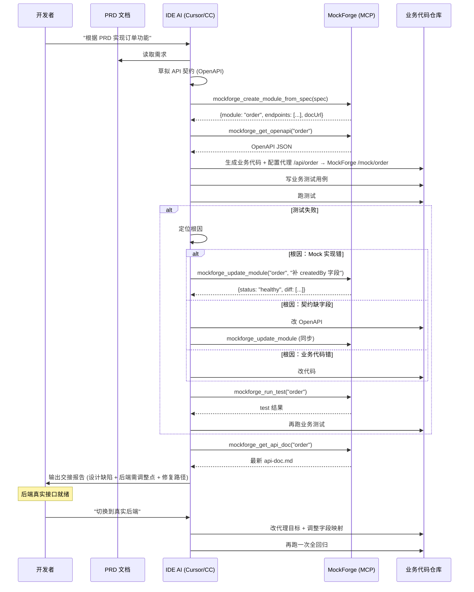
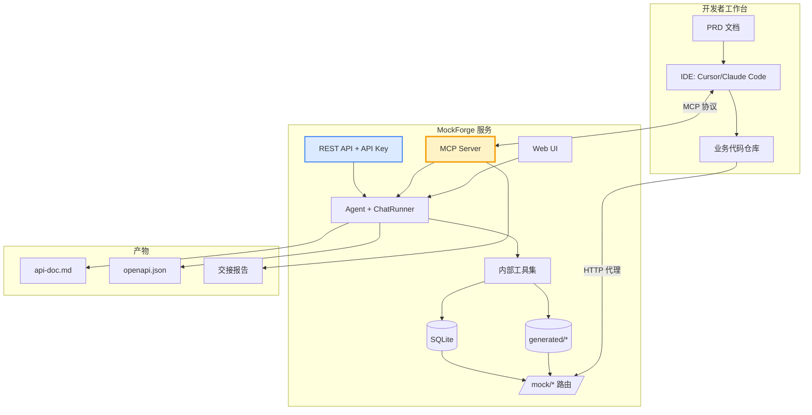

# MockForge 在 AI 驱动开发全流程中的定位分析

> 生成日期：2026-04-21
> 基于：MockForge 当前代码状态（Step-UX-Polish-5 完成）+ 用户描述的目标工作流

---

## 一、用户方案复述（抽象为阶段模型）

把用户描述的流程抽象出来，是这样一条链路：

```
PRD (需求文档)
   │
   ▼  ① 生成接口契约
API Spec (OpenAPI / 接口文档)
   │
   ▼  ② 按契约生成 Mock
MockForge 生成 Mock 接口 + 数据
   │
   ▼  ③ 业务开发
IDE 中的 AI（Cursor / Claude Code）基于 PRD + API Spec 实现前端/业务代码，
同时把请求代理到 MockForge
   │
   ▼  ④ 自测回归
AI 跑用例 → 发现 Mock 与预期不一致 / 契约漏字段 / 设计缺陷
   │
   ▼  ⑤ 定位修复
根因可能在：PRD、API Spec、Mock 实现三者之一
   - 如果是 Mock 出错 → AI 需要「反向」调用 MockForge 去修 ← **当前缺口**
   - 如果是契约漏字段 → 修契约 → 同步 Mock
   - 如果是 PRD 歧义 → 记录待确认
   │
   ▼  ⑥ 循环 ④⑤ 直到绿
   │
   ▼  ⑦ 输出交接报告
报告内容：设计缺陷、契约修订、后端需调整点、修复路径
   │
   ▼  ⑧ 真实后端接口到位后，替换 Mock → 再跑一次全回归
```

**核心诉求：** 让 IDE 里的 AI 助手能"远程操控" MockForge，而不是让用户在两个工具之间手动搬运。

---

## 二、先回答最根本的问题：这个项目本身有价值吗？

### 2.1 "AI 本来就能自己 Mock" 的反驳

你担心的是：Cursor / Claude Code 本身就能让 AI 直接写 `msw`、`json-server`、Vite middleware 就地 mock，为什么还要一个独立项目？

**独立 Mock 服务的不可替代价值：**

| 维度 | 就地 Mock（msw/json-server） | MockForge 独立服务 |
|------|------------------------------|-------------------|
| **跨项目复用** | 绑死在当前仓库 | 一次生成，N 个前端/移动端/测试环境共享 |
| **状态持久化** | 进程内存，重启即失 | SQLite 真实持久化，支持 CRUD 回放、历史追溯 |
| **多人协作** | 各自本地 mock，容易漂移 | 团队共享同一 Mock 契约，所见即所得 |
| **后端切换** | 前端要改代码切真接口 | 只需改代理指向，前端零改动 |
| **延迟/异常模拟** | 要手写中间件 | 内置能力（你已经做了 Step 19-23） |
| **数据管理** | 改 fixture 文件 | DataTable UI + bulk_generate + CRUD |
| **契约版本化** | 无 | api-doc.md + OpenAPI 导出（你已经做了） |

**结论：独立 Mock 服务不是伪需求，但它真正的护城河是"团队协作 + 跨项目 + 契约化"，不是"生成 mock 这个动作本身"。**

### 2.2 MockForge 当下的真实差异化

看完 `PROGRESS.md` 后，你已经在做的事情里，这几项是真差异化：

1. **从 PRD 直接生成"模块"**（controller.ts + schema.sql + _meta.json + test.ts + api-doc.md 五件套）——这是比 json-server / msw 高一个层次的抽象
2. **内置 test.ts 自动回归**——Mock 自己可以证明自己是对的
3. **api-doc.md + OpenAPI 导出**——Mock 同时是"活着的契约"
4. **DataTable + 数据管理 Tab**——生成完还能手工/批量造数
5. **可恢复聊天 + 事件日志**——AI 任务断线不丢

**但有一个致命短板：整个系统是"封闭的"。** 你在 MockForge 里和 AI 对话，AI 修改 MockForge 内部的文件；然而当你的"真实业务开发"发生在另一个 IDE 会话里时，那个 AI 无法触达 MockForge——必须手工复制粘贴、手工切屏。

**这就是你直觉到的那个缺口。** 你的方案方向是对的。

---

## 三、MockForge 当前能力盘点（定位缺口）

### 3.1 已有 HTTP API（面向自家前端）

```
/api/auth         登录/注册/会话
/api/chat         SSE 流式对话 + pause/read
/api/sessions     会话列表
/api/modules      模块 CRUD
/api/data         数据增删改查（REST 7 条）
/api/providers    模型服务商
/api/presets      提示词预设
/api/upload       文件上传
/api/test         手动触发 test.ts
/mock/*           动态 mock 路由（用户生成的接口）
```

### 3.2 已有 Agent 工具（面向内部 LLM）

```
set_module_intent  声明要创建/修改的模块
write_file         写模块文件
read_file          读模块文件
run_test           执行 test.ts
manage_data        insert / bulk_generate / delete / clear
list_modules       列模块
delete_module      删模块
```

### 3.3 **真正的缺口（你问题的核心）**

**MockForge 的能力 100% 锁在内部。外部 AI 想要：**

1. "根据这份 PRD 帮我生成一个 Mock 模块" → 做不到（要用户手动在 MockForge 里开对话）
2. "把我刚写的 openapi.yaml 同步到 Mock" → 做不到
3. "跑一下 order 模块的 test.ts，看看是不是对齐" → 做不到
4. "Mock 返回字段少了 `createdBy`，帮我加上" → 做不到
5. "导出 order 模块的最新契约给我" → 做不到
6. "列一下我现有的所有 Mock 模块" → 做不到

---

## 四、三种可行架构对比

### 方案 A：MCP Server 模式（强推荐 ⭐）

让 MockForge 同时暴露一个 **MCP Server**（Model Context Protocol，Anthropic 开源协议，Claude Code / Cursor 等都已支持）。外部 AI 通过 stdio 或 HTTP transport 连到 MockForge，把内部工具集**镜像**为 MCP Tools。

```
┌─────────────────────────────┐      ┌─────────────────────────┐
│  IDE (Cursor / Claude Code) │      │       MockForge         │
│                             │      │                         │
│   ┌────────────┐            │ MCP  │  ┌─────────────────┐    │
│   │  AI Agent  │◄──────────►│──────┼─►│  MCP Server     │    │
│   └────────────┘ list_tools │      │  │  (透传到内部)    │    │
│        │        call_tool   │      │  └────────┬────────┘    │
│        │                    │      │           │             │
│   ┌────▼────────┐           │      │  ┌────────▼────────┐    │
│   │ 业务代码仓库  │           │      │  │ Agent 工具集     │    │
│   │ + 代理到 /mock│───────────┼──────┼─►│ + mock-router   │    │
│   └─────────────┘  HTTP      │      │  └─────────────────┘    │
└─────────────────────────────┘      └─────────────────────────┘
```

**MCP 会暴露的工具（最小集）：**

| MCP Tool | 对应内部能力 | 用例 |
|----------|-------------|------|
| `mockforge_create_module_from_spec` | chat + write_file 组合 | 传入 PRD 片段或 OpenAPI → 生成模块 |
| `mockforge_update_module` | chat 编辑流 | "给 order 加 createdBy 字段" |
| `mockforge_list_modules` | list_modules | AI 发现有哪些接口可用 |
| `mockforge_get_api_doc` | 读 api-doc.md | 让 AI 拿到最新契约 |
| `mockforge_get_openapi` | ModuleDetailPage 里那个导出 | 喂给 AI 做契约对齐 |
| `mockforge_run_test` | run_test | 回归验证 |
| `mockforge_manage_data` | manage_data | 造数、清数 |
| `mockforge_get_module_health` | module-health.ts | 检查 Mock 是否 healthy |
| `mockforge_endpoint_curl` | 返回某端点的 curl 示例 | 便于 AI 调试 |

**优势：**
- 协议标准化，Cursor / Claude Code / Zed / Windsurf 都能直接用
- AI 调用体验和调用本地工具完全一致
- 不破坏现有 Web UI，两套入口并存
- 生态：未来可能出现的 IDE AI 工具都会支持 MCP

**成本：** 中等。需要写一个 `src/server/mcp/` 层 + 鉴权（API Key）+ 文档。MCP SDK 成熟，实际工作量不大。

### 方案 B：REST API + API Key（兜底）

不走 MCP，直接把现有 `/api/*` 加一套 `X-API-Key` 鉴权（绕过 JWT），AI 在 Cursor 里通过 `curl` / `fetch` 调用。

**优势：** 工作量最小（几乎是改鉴权中间件）。
**劣势：**
- AI 每次调用要自己构造 HTTP 请求、处理错误
- 没有工具发现能力（AI 不知道有哪些接口）
- 用户体验退化为"让 AI 写 curl"

**适用场景：** 作为 MCP 的兜底，或给不支持 MCP 的工具用。

### 方案 C：CLI 工具 `mockforge`

发一个 npm 全局 CLI（`npx @mockforge/cli`），AI 在终端调用。

**优势：** 任何 IDE/任何 AI 都能用（只要能跑 shell）。
**劣势：** 每次调用要启动进程、输出解析复杂、状态不持久。

**适用场景：** CI / 脚本化场景，不是 IDE 主流场景。

### 推荐组合：**A（MCP）+ B（REST with API Key）并存**
- MCP 服务 IDE AI（主力场景）
- REST + API Key 服务 CI / 脚本 / 不支持 MCP 的工具

---

## 五、推荐的完整执行流程（落地版）

### 5.1 端到端时序图



### 5.2 关键环节的详细规则

**① PRD → API 契约生成**
- IDE 侧 AI 先产出 OpenAPI 草案（不是 MockForge 做），因为 IDE AI 上下文里有整个业务代码库
- 把 OpenAPI 作为 `spec` 传给 MockForge（MockForge 不重新解读 PRD）

**② Mock 创建后要做的事**
- MockForge 返回 `docUrl`（Web 上看得见的文档页）给 IDE AI，方便用户验收
- 返回 `mockBaseUrl`（如 `http://localhost:3000/mock/order`）给 IDE AI 写代理

**③ 自测发现不一致时的根因树**

```
测试失败
├── 请求发不出去         → 代理配置错 (Repo)
├── 响应结构不匹配
│   ├── Mock 返回字段少   → Mock 实现错 (MockForge)
│   └── 业务 parse 写错  → Repo
├── 业务流走不通
│   ├── Mock 状态机错    → MockForge
│   └── 业务编排错      → Repo
└── 契约本身矛盾        → PRD 歧义 (记报告，让人决定)
```

**④ 交接报告的结构化字段**（让 AI 生成时有模板）

```markdown
# [模块名] Mock 交接报告

## 契约变更 (相对于初始 PRD 解读)
- [字段] 新增：createdBy  | 原因：业务场景 X 需要
- [端点] 变更：PATCH /orders/:id | 原因：部分更新需求

## 设计缺陷
- 状态机缺少 "REFUNDING" 中间态，建议补

## 后端需调整项
- 分页 total 字段必须返回，前端列表依赖
- 删除接口需返回 204 而非 200

## 修复路径
- MockForge: 见 /mock/order 的 api-doc.md v2
- 业务仓库: commit abc123
```

---

## 六、如果重新设计，有没有更优解？

头脑风暴几种"颠覆式"方案，然后评估：

### 思路 1：MockForge 变成 VSCode / Cursor 插件

把 MockForge 直接塞进 IDE。
- **优点：** 零切屏
- **劣势：** 失去"跨项目共享"、"多人协作"、"独立服务"的全部优势。本质上退化成 msw 的加强版
- **否决**

### 思路 2：放弃 Web UI，纯 MCP + 配置文件

MockForge 变成"无头服务"，所有操作通过 MCP，配置存 yaml。
- **优点：** 极简
- **劣势：** 失去可视化数据管理、实时观察 Mock 日志等体验。你现有的 Chat UI、DataTable、文档页 Tab 是价值增量
- **否决**

### 思路 3：双向同步——真实后端就位后自动 diff

这个值得做，是**可以加到路线图的增强**，不是替代方案：
- MockForge 持有"理想契约"
- 真实后端就位后，AI 抓真后端的 OpenAPI，和 MockForge 契约 diff
- 自动生成字段映射适配层 或 报告不一致
- 这是方案 A 的延伸，不是另一个方案

### 思路 4：让 MockForge 反向驱动前端（声明式）

前端声明"我要调用 GET /orders"，MockForge 自动：
- 补全请求 SDK
- 生成 TypeScript 类型
- 维护代理配置
- 这是 `openapi-typescript-codegen` 已经在做的事，MockForge 只需输出标准 OpenAPI 即可无缝接入

### 最终判断

**用户你当前的方案（MockForge 独立 + 向外暴露）= 最优方向。** 只需把"向外暴露"具象化为 MCP Server + REST API Key 这两个通道。不需要推翻重来。

---

## 七、实施路线图（建议分 3 个 Step）

### Step-MCP-1：MCP Server 骨架（1-2 天）

- [ ] 引入 `@modelcontextprotocol/sdk`
- [ ] 新增 `src/server/mcp/server.ts`（HTTP transport + stdio transport 双支持）
- [ ] 鉴权：沿用 API Key（每个用户可在 Settings 页生成）
- [ ] 先暴露 3 个只读工具：`list_modules`、`get_api_doc`、`get_openapi`
- [ ] 文档：README 里加 IDE 配置片段（Cursor `mcp.json`、Claude Code `.mcp.json`）
- [ ] 测试：Playwright 直连 MCP Server 跑一轮

### Step-MCP-2：写能力 + 会话桥接（2-3 天）

- [ ] 暴露 `create_module_from_spec`：内部开一个"无 UI"的 ChatRunner 会话，注入 OpenAPI 作为初始消息，跑完后返回结果
- [ ] 暴露 `update_module`：同上，但走 edit 分支
- [ ] 暴露 `run_test`、`manage_data`、`get_module_health`
- [ ] 关键：MCP 调用产生的会话也要显示在 Web UI（共享 sessions 表），用户随时能接手
- [ ] 进度反馈：MCP 流式返回（AI SDK 的 progress notifications）

### Step-MCP-3：REST + API Key 兜底 + 交接报告工具（1-2 天）

- [ ] `/api/v1/*` 加一层 API Key 中间件，复用现有 REST handler
- [ ] MCP 新工具 `generate_handoff_report(moduleName)`：输出上面 5.2 ④ 的结构化报告
- [ ] CLI 草稿（可选，先留 npm-link 的内部 CLI 跑通即可）

### 后续可选增强

- 真实后端 OpenAPI 导入 + diff 工具
- Watch 模式：业务仓库跑测试失败自动回传给 MockForge，让它主动建议修复
- 多人协作：Mock 契约版本化（Git-like）

---

## 八、核心架构图（目标态）



图中 **黄色高亮的 MCP Server** 是你当前最该补的那块。

---

## 九、给你的直接建议

1. **你的出发点没错。** 独立 AI Mock 服务的核心价值不在"AI 生成 Mock 数据"，而在"契约化 + 跨项目 + 团队共享 + 活文档"。你做的对。

2. **你想复杂的地方被卡住的，其实是同一个问题：缺一个对外接口。** 一旦 MCP 打通，你描述的那个 PRD → 契约 → Mock → 业务 → 自测 → 修复 → 报告的完整闭环会非常自然。

3. **下一个 Step 建议就叫 `Step-MCP-1`**，先做只读 3 工具跑通链路。生成子计划 `plans/STEP-MCP-1-PLAN.md`，走你项目现有的 CURSOR/PLAN 执行协议。

4. **不要一次做完所有工具。** 先用只读 MCP 让 IDE AI 能"看"Mock（list + get_doc + get_openapi），验证集成体验 → 再加写能力（create/update）。这样风险低、反馈快。

5. **Web UI 不要砍。** 你的 Web UI 是"人类可视化接管 + 数据手工修正"的关键，MCP 只是"机器通道"。两者并存不冲突。

6. **接口文档的两种来源（后端给 vs MockForge 生成）** 其实可以统一处理：都存成 OpenAPI，进 MockForge 时走 `import_openapi` 工具；来自 MockForge 的走 `export_openapi`。这样你描述里那个"真实文档到位后替换" 只是一个 `import` → `diff` → `update` 的循环，不是两条路。

---

## 十、一句话总结

> **你缺的不是"更好的架构"，是把现有封闭能力通过 MCP 打开一条口子。** 做完 MCP Server，你描述的那整条 AI 驱动开发流水线就自然成立了。
